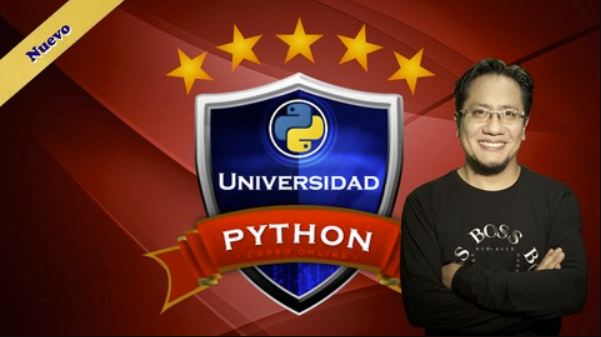

# Curso de Universidad Python 

## Descripcion 

Curso tomado en la platafoma udemy m+as de 40 hrs

https://www.udemy.com/course/universidad-python-desde-cero-hasta-experto-django-flask-rest-web/

De Cero a Experto en Python: POO en Python, Aplicaciones Web Django, Flask, Jinja, SQL Alchemy, Postgresql, PyCharm!

El curso es impartido por Ing. Ubaldo Acosta

## Galeria

## Lo que se aprendera 

- Aprenderán a programar con Python desde cero hasta experto!
- Desde los temas más básicos, hasta intermedios y avanzados!
- Programación Orientada a Objetos con Python
- Conexión a Bases de Datos con Python y Postgresql
- Creación de aplicaciones Web con Django y Python
- Creación de aplicaciones Web con Flask y Python
- Todo dentro de un mismo curso, Universidad Python